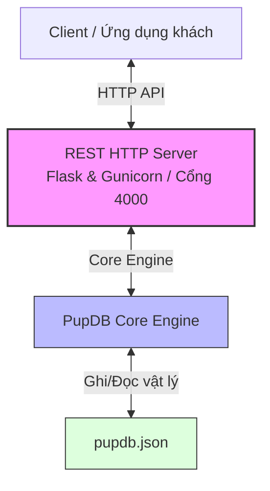
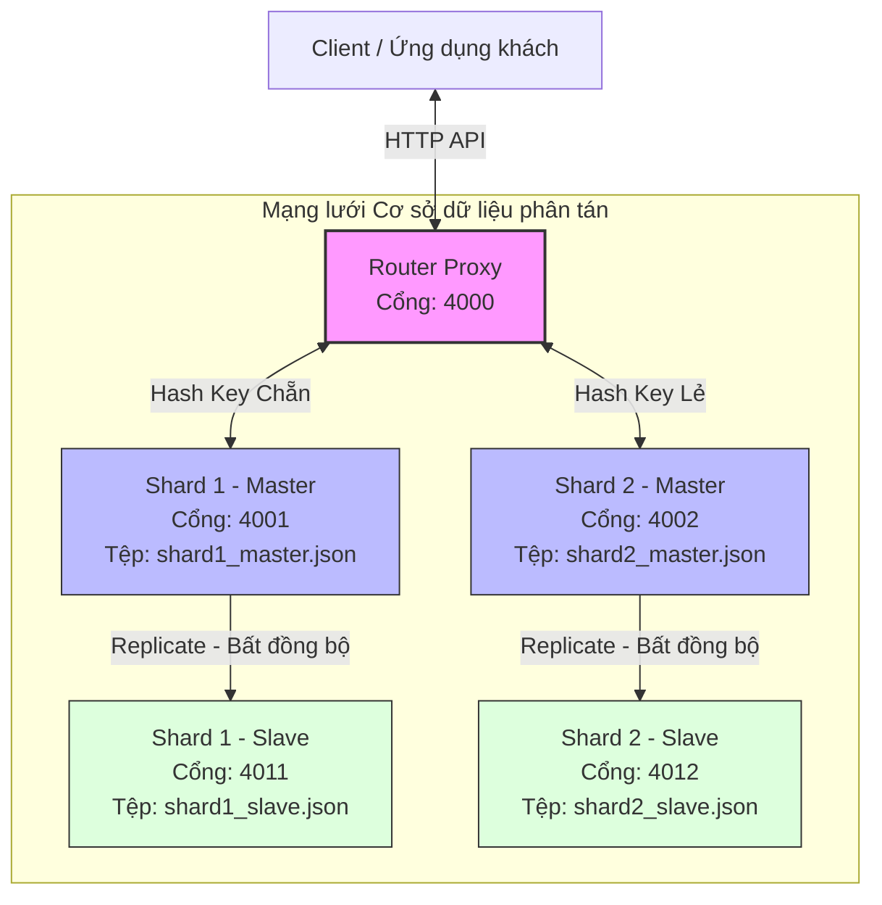

# PupDB: Hệ Quản Trị Cơ Sở Dữ Liệu Key-Value & Hệ Thống Phân Tán (Cluster)

**PupDB** là một hệ quản trị cơ sở dữ liệu dạng Khóa - Giá trị (Key-Value Database) mã nguồn mở, được viết bằng ngôn ngữ Python với triết lý thiết kế tối giản, gọn nhẹ. 

Dự án này ban đầu là một cơ sở dữ liệu nhúng dựa trên tệp tin phẳng (File-based), sau đó được nghiên cứu phát triển và nâng cấp thành một **Hệ thống phân tán hoàn chỉnh (PupDB Cluster)** nhằm đáp ứng yêu cầu môn học **Ứng Dụng Phân Tán (Distributed Applications)**.

---

## 1. Tổng Quan Về Dự Án PupDB

### 1.1. Mục đích ra đời
Mục đích cốt lõi của PupDB là cung cấp một kho lưu trữ dữ liệu phi quan hệ (NoSQL) cấu trúc gọn nhẹ, hoạt động bền bỉ dựa trên tệp tin định dạng JSON, đi kèm một giao diện lập trình API tối giản tương tự như kiểu dữ liệu `dict` của Python mà không yêu cầu các bước cấu hình hoặc thiết lập máy chủ phức tạp.

### 1.2. Chức năng chính
*   **Thao tác dữ liệu Key-Value cơ bản**: Hỗ trợ các hàm nguyên tử như thiết lập giá trị (`set`), truy xuất dữ liệu (`get`), xóa khóa (`remove`), lấy danh sách khóa (`keys`), giá trị (`values`), cặp phần tử (`items`), hiển thị toàn bộ dữ liệu (`dumps`) và làm trống DB (`truncate_db`).
*   **Hỗ trợ đa tiến trình và đa luồng (Concurrency)**: Kiểm soát tính toàn vẹn dữ liệu khi có nhiều luồng/tiến trình cùng truy cập thông qua cơ chế khóa tệp tin vật lý (`filelock`), đảm bảo không xảy ra xung đột đọc/ghi (Race condition).
*   **Giao diện mạng REST-based HTTP**: Tích hợp sẵn máy chủ Flask chuyển đổi các phương thức Python thành các Endpoint HTTP (GET, POST, DELETE). Tính năng này giúp các ứng dụng viết bằng ngôn ngữ khác (C, Java, Dart, PHP,...) có thể dễ dàng kết nối và thao tác với PupDB qua mạng.

### 1.3. Ứng dụng trong thực tế
*   **Cơ sở dữ liệu nhúng cho thiết bị IoT**: Sử dụng trên các vi điều khiển hoặc máy tính nhúng (như Raspberry Pi) để lưu trữ cấu hình hệ thống hoặc trạng thái hoạt động của thiết bị với dung lượng nhỏ (vài Megabytes).
*   **Hệ thống Cache phân tán cục bộ**: Làm bộ nhớ đệm chia sẻ cấu hình, trạng thái phiên làm việc (Session) giữa các Microservices thông qua các Endpoint RESTful mà không cần thiết lập hệ thống lớn như Redis.

---

## 2. Kiến Trúc Hệ Thống & Các Thành Phần

Hệ thống được phát triển qua hai giai đoạn tương ứng với hai phiên bản: **Phiên bản Đơn Node (Cơ bản)** và **Phiên bản Phân tán (Nâng cấp)**.

### 2.1. Phiên Bản Đơn Node (Bản Cũ - Chỉ có Database & REST API cục bộ)

Trong phiên bản này, PupDB hoạt động độc lập trên một máy chủ duy nhất. Giao diện REST HTTP Server tiếp nhận tương tác từ Client, xử lý qua Core Engine và lưu trực tiếp xuống một tệp tin JSON vật lý.

#### Sơ đồ kiến trúc Đơn Node:


*   **REST HTTP Server (Flask & Gunicorn)**: Lắng nghe mặc định tại cổng 4000, nhận các yêu cầu HTTP và chuyển tiếp xuống bộ lõi Core Engine.
*   **PupDB Core Engine**: Trái tim xử lý của hệ thống. Đồng bộ dữ liệu và kiểm soát đa luồng thông qua khóa tệp tin.
*   **JSON Physical File (`pupdb.json`)**: Tầng lưu trữ vật lý persistent trên ổ cứng.

---

### 2.2. Phiên Bản Phân Tán (Bản Mới - PupDB Cluster)

Để đưa dự án PupDB thành một hệ thống phân tán hoàn chỉnh chịu lỗi tốt và có khả năng mở rộng, hệ thống đã được nâng cấp thêm hai tính năng phân tán cốt lõi:

#### Tính năng 1: Sao chép dữ liệu phân tán theo mô hình Active-Passive (Replication)
*   **Giải pháp**: Thiết lập cấu hình hệ thống gồm các cặp Node chạy độc lập trên các địa chỉ IP/Cổng khác nhau (Node Master và Node Slave).
*   **Cơ chế hoạt động**: Chỉnh sửa Endpoint `/set` và `/remove` của Node Master. Mỗi khi Node Master nhận một request ghi/xóa dữ liệu thành công vào file cục bộ, nó sẽ tự động kích hoạt một luồng phụ (Thread) gửi một HTTP Request song song tương ứng sang Endpoint của Node Slave để đồng bộ dữ liệu ngay lập tức. Tính năng này giúp phân tán rủi ro và đảm bảo tính sẵn sàng cao (**High Availability**).

#### Tính năng 2: Phân mảnh dữ liệu phân tán (Sharding / Horizontal Partitioning) dựa trên Key
*   **Giải pháp**: Viết một Module định tuyến phân tán (Router Proxy) đứng trước các Node PupDB.
*   **Cơ chế hoạt động**: Khi Client gửi dữ liệu lên Router qua một cổng tập trung (Cổng 4000), Router sẽ chạy một thuật toán băm (lấy mã ASCII của ký tự đầu tiên trong Key chia lấy dư cho số lượng Shard Master: `ord(key[0]) % 2`). 
    *   Nếu kết quả là `0` -> Router điều hướng request lưu trữ đến **Shard 1 Master** (Cổng 4001).
    *   Nếu kết quả là `1` -> Router điều hướng request lưu trữ đến **Shard 2 Master** (Cổng 4002).
*   **Data Aggregation (Tổng hợp dữ liệu)**: Đối với các truy vấn tổng hợp như `/keys` hoặc `/dumps`, Router Proxy sẽ gửi các yêu cầu song song đến tất cả các Shard Master, sau đó gộp (merge) và định dạng dữ liệu trước khi phản hồi về cho Client.

#### Sơ đồ kiến trúc Phân tán:


---

## 3. Cài Đặt Môi Trường

Trước khi thực hiện chạy các bản demo, hãy đảm bảo bạn đã cài đặt Python (phiên bản 3.6 trở lên) và cài đặt đầy đủ các thư viện cần thiết:

```bash
pip install -r requirements.txt
```

*(Các thư viện chính bao gồm: `Flask`, `filelock`, `pytest`,...)*

---

## 4. Hướng Dẫn Chạy Demo Chi Tiết

### 4.1. Chạy Demo Bản Cũ (Đơn Node - Đơn giản)

Để chạy thử nghiệm tính năng cơ sở dữ liệu Key-Value đơn node qua HTTP API:

1.  **Khởi động máy chủ đơn lẻ**:
    Mở Terminal và chạy lệnh sau để khởi động REST server đơn node trên cổng 4000, lưu dữ liệu vào tệp `pupdb.json`:
    ```bash
    python -c "import os; os.environ['PUPDB_FILE_PATH']='pupdb.json'; from pupdb.rest import APP; APP.run(port=4000)"
    ```

2.  **Sử dụng cURL hoặc Postman để kiểm tra các API Endpoints**:
    *   **Thêm dữ liệu (`/set`)**:
        ```bash
        curl -XPOST http://127.0.0.1:4000/set -H "Content-Type: application/json" -d "{\"key\": \"name\", \"value\": \"PupDB_User\"}"
        ```
    *   **Lấy dữ liệu (`/get`)**:
        ```bash
        curl -XGET http://127.0.0.1:4000/get?key=name
        ```
    *   **Liệt kê tất cả các khóa (`/keys`)**:
        ```bash
        curl -XGET http://127.0.0.1:4000/keys
        ```
    *   **Kết xuất toàn bộ dữ liệu (`/dumps`)**:
        ```bash
        curl -XGET http://127.0.0.1:4000/dumps
        ```
    *   **Xóa một khóa (`/remove/<key>`)**:
        ```bash
        curl -XDELETE http://127.0.0.1:4000/remove/name
        ```

---

### 4.2. Chạy Demo Bản Mới (Phân Tán - Cluster)

Bản phân tán được tự động hóa tối đa thông qua các tập lệnh hỗ trợ chạy trên Windows.

#### Bước 1: Khởi động toàn bộ 5 Node trong Cluster
Mở PowerShell hoặc Command Prompt tại thư mục dự án và chạy tập lệnh khởi tạo cụm [start_cluster.py](file:///d:/LongWork/UDPL-BTL/pupdb/start_cluster.py):
```bash
python start_cluster.py
```
*   **Hành động**: Tập lệnh này sẽ tự động xóa các tệp tin dữ liệu `.json` cũ để đảm bảo dữ liệu demo sạch sẽ, sau đó khởi chạy 5 tiến trình con (1 Router, 2 Master, 2 Slave) tương ứng với các cổng từ 4000 đến 4012.
*   **Kết quả trên màn hình**:
    ```text
    === KHỞI ĐỘNG HỆ THỐNG PHÂN TÁN PUPDB CLUSTER ===
    -> Đang khởi động Shard 1 Slave tại cổng 4011...
    -> Đang khởi động Shard 1 Master tại cổng 4001...
    -> Đang khởi động Shard 2 Slave tại cổng 4012...
    -> Đang khởi động Shard 2 Master tại cổng 4002...
    -> Đang khởi động Router Proxy tại cổng 4000...
    
    ==================================================
     TẤT CẢ CÁC THÀNH PHẦN ĐÃ ĐƯỢC KHỞI ĐỘNG THÀNH CÔNG!
    ==================================================
     - Router Proxy (Cổng nhận yêu cầu chính): http://127.0.0.1:4000
     - Shard 1 (Master): http://127.0.0.1:4001  |  Shard 1 (Slave): http://127.0.0.1:4011
     - Shard 2 (Master): http://127.0.0.1:4002  |  Shard 2 (Slave): http://127.0.0.1:4012
    ```

#### Bước 2: Chạy chương trình Client Demo tương tác
Giữ nguyên cửa sổ chạy `start_cluster.py`. Mở thêm một tab/cửa sổ Terminal mới tại cùng thư mục và chạy tập lệnh [run_demo_client.py](file:///d:/LongWork/UDPL-BTL/pupdb/run_demo_client.py):
```bash
python run_demo_client.py
```
*   **Hành động**: Tập lệnh sẽ dẫn dắt người dùng qua 3 phần trình diễn cốt lõi. Hãy nhấn **Enter** tại mỗi bước để xem dữ liệu được thay đổi thực tế trên từng nút vật lý như thế nào.

---

## 5. Các Trình Diễn Cốt Lõi Khi Thuyết Trình & Từ Khóa Ghi Điểm

Để đạt điểm tối đa từ giảng viên, hãy chú trọng giải thích các kịch bản demo bằng các từ khóa học thuật:

### 💡 Trình diễn 1: Phân mảnh ngang dữ liệu (Horizontal Sharding) & Thuật toán định tuyến (Routing Algorithm)
*   **Thao tác**: Client thêm 5 khóa: `apple`, `banana`, `cherry`, `date`, `eggplant` qua Router tập trung (Cổng 4000).
*   **Giải thích**: 
    *   Khóa `banana` (ký tự đầu `'b'`, mã ASCII = 98. Lấy `98 % 2 = 0` => Định tuyến về **Shard 1 Master**).
    *   Khóa `apple` (ký tự đầu `'a'`, mã ASCII = 97. Lấy `97 % 2 = 1` => Định tuyến về **Shard 2 Master**).
*   **Minh chứng thực tế**: Đọc trực tiếp nội dung các tệp dữ liệu của từng Shard.
    *   `shard1_master.json` chỉ chứa: `banana`, `date`.
    *   `shard2_master.json` chỉ chứa: `apple`, `cherry`, `eggplant`.
*   **Từ khóa ăn điểm**: *Horizontal Partitioning (Phân mảnh ngang)*, *Consistent Hashing-like Routing (Định tuyến dạng băm nhất quán)*, *High Scalability (Khả năng mở rộng quy mô)*.

### 💡 Trình diễn 2: Tính sẵn sàng cao & Nhân bản dữ liệu (Replication & High Availability)
*   **Thao tác**: Chương trình truy vấn dữ liệu trực tiếp vào 2 nút Slave (cổng 4011 và 4012).
*   **Giải thích**: Dữ liệu ghi trên nút Master được tự động sao chép sang nút Slave thông qua một **luồng phụ bất đồng bộ (Asynchronous Replication)** ngầm, giúp thao tác ghi của Client không bị nghẽn (Non-blocking Write).
*   **Minh chứng thực tế**: Dữ liệu trên file `shard1_slave.json` trùng khớp hoàn toàn với `shard1_master.json`.
*   **Từ khóa ăn điểm**: *Master-Slave Architecture*, *Asynchronous Replication (Nhân bản bất đồng bộ)*, *Redundancy & Fault-Tolerance (Tính dư thừa và Chịu lỗi)*.

### 💡 Trình diễn 3: Tính minh bạch phân tán (Distribution Transparency)
*   **Thao tác**: Client gửi yêu cầu lấy toàn bộ dữ liệu qua Router Proxy (`/keys`, `/dumps`).
*   **Giải thích**: Client không cần quan tâm dữ liệu nằm ở shard nào hay bị chia làm bao nhiêu mảnh. Router Proxy sẽ tự động phân phối yêu cầu song song đến toàn bộ các Shard Master, thu thập kết quả, gộp dữ liệu và loại bỏ trùng lặp trước khi trả về.
*   **Từ khóa ăn điểm**: *Location Transparency (Tính minh bạch vị trí)*, *Fragmentation Transparency (Tính minh bạch phân mảnh)*, *Data Aggregation (Tổng hợp dữ liệu)*.

---

## 6. Các Câu Hỏi Phản Biện Thường Gặp (Q&A) & Gợi Ý Trả Lời

Khi thầy cô đặt câu hỏi phản biện, hãy áp dụng các câu trả lời mang tính chuyên môn dưới đây:

*   **Hỏi: Thuật toán định tuyến dựa trên ASCII chữ cái đầu tiên có nhược điểm gì? Khắc phục thế nào?**
    > **Trả lời:** Nhược điểm lớn nhất là phân bổ dữ liệu không đều (Data Skew / Hotspots). Nếu toàn bộ các khóa đều bắt đầu bằng chữ cái giống nhau (ví dụ: cùng chữ 'a'), tất cả dữ liệu sẽ bị dồn vào một Shard duy nhất, làm mất tác dụng của hệ thống phân tán.
    > 
    > **Khắc phục:** Trong thực tế, chúng ta sẽ áp dụng các hàm băm mạnh mẽ hơn như **MD5** hoặc **SHA-256** trên toàn bộ chuỗi của khóa (chứ không chỉ ký tự đầu) rồi lấy giá trị băm chia dư cho số lượng nút, hoặc kết hợp với kỹ thuật **Consistent Hashing (Băm nhất quán)** cùng các nút ảo (**Virtual Nodes**) để cân bằng tải tốt hơn.

*   **Hỏi: Nếu nút Master của Shard 1 bị sập, hệ thống sẽ xử lý thế nào?**
    > **Trả lời:** Dữ liệu hiện tại đã được nhân bản an toàn tại Shard 1 Slave. Trong một hệ thống lớn, khi phát hiện nút Master sập (thông qua cơ chế Heartbeat), cơ chế **Leader Election (Bầu chọn trưởng nhóm)** như thuật toán **Raft** hoặc **Paxos** sẽ tự động nâng cấp nút Slave tương ứng lên làm Master mới. Router Proxy sau đó sẽ cập nhật cấu hình định tuyến để chuyển tiếp yêu cầu ghi đến nút Master mới này.

*   **Hỏi: Cơ chế nhân bản bất đồng bộ (Asynchronous Replication) có điểm yếu gì về tính nhất quán dữ liệu?**
    > **Trả lời:** Điểm yếu lớn nhất là có thể xảy ra độ trễ nhân bản (Replication Lag). Nếu nút Master vừa ghi thành công và sập ngay lập tức trước khi kịp đồng bộ sang Slave, dữ liệu ghi mới đó sẽ bị mất (vi phạm tính nhất quán mạnh - Strong Consistency). Đây là sự đánh đổi theo định lý **CAP theorem**, trong đó hệ thống của chúng ta ưu tiên Tính khả dụng và Tính chịu lỗi phân mảnh (**AP**) hơn là Tính nhất quán tức thời (**CP**).

---

## 7. Cấu Trúc Mã Nguồn Quan Trọng
*   [pupdb/core.py](file:///d:/LongWork/UDPL-BTL/pupdb/pupdb/core.py): Lõi cơ sở dữ liệu vật lý (Đọc, ghi file JSON, khóa tệp filelock).
*   [pupdb/rest.py](file:///d:/LongWork/UDPL-BTL/pupdb/pupdb/rest.py): HTTP Server cung cấp giao diện REST API cho từng Node (Master/Slave).
*   [pupdb/router.py](file:///d:/LongWork/UDPL-BTL/pupdb/pupdb/router.py): Máy chủ Router Proxy điều phối yêu cầu, định tuyến ghi dựa trên key và gộp dữ liệu.
*   [start_cluster.py](file:///d:/LongWork/UDPL-BTL/pupdb/start_cluster.py): Script Python tự động dọn dẹp và chạy đồng thời 5 Node của hệ thống Cluster.
*   [run_demo_client.py](file:///d:/LongWork/UDPL-BTL/pupdb/run_demo_client.py): Kịch bản client chạy demo tự động từng bước có thuyết minh tiếng Việt.
*   [huong_dan_demo.md](file:///d:/LongWork/UDPL-BTL/pupdb/huong_dan_demo.md): Tài liệu hướng dẫn thuyết trình dự án cho thành viên trong nhóm.
