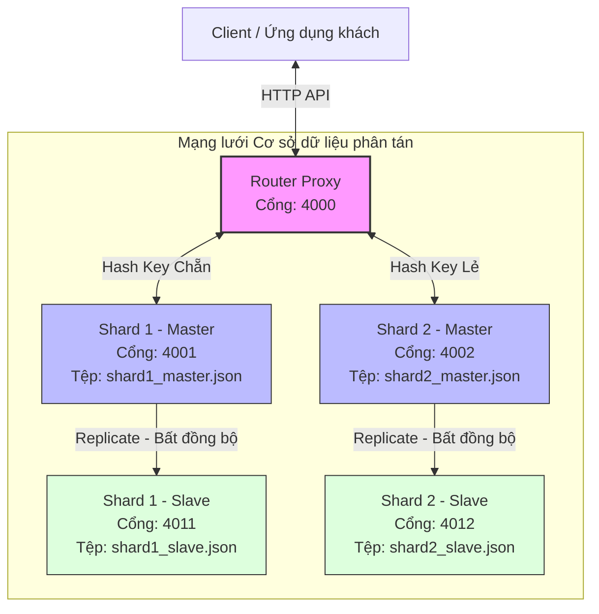

# Hướng Dẫn Demo Sản Phẩm - Môn Ứng Dụng Phân Tán (Distributed Applications)

Tài liệu này hướng dẫn chi tiết cách chạy demo hệ thống cơ sở dữ liệu phân tán **PupDB Cluster** để thuyết trình trước thầy cô và hội đồng chấm điểm. Hệ thống đã được lập trình sẵn kịch bản và tự động hóa các thao tác phức tạp trên Windows.

---

## 1. Sơ Đồ Kiến Trúc Hệ Thống (Distributed Architecture)

Khi thuyết trình, hãy bắt đầu bằng việc giải thích cấu trúc phân tán của hệ thống. Bạn có thể sử dụng sơ đồ dưới đây để vẽ lên slide hoặc bảng:



### Giải thích các khối trong kiến trúc:
1. **Client**: Gửi các yêu cầu lưu trữ (`/set`) hoặc lấy dữ liệu (`/get`, `/keys`, `/dumps`) đến cổng tập trung của **Router**.
2. **Router Proxy (Cổng 4000)**: Hoạt động như một Middleware/Load Balancer. Nhận yêu cầu từ client, băm (hash) khóa dựa trên ký tự đầu tiên (`ord(key[0]) % 2`), định tuyến chính xác đến Shard Master quản lý phân mảnh đó. Đối với các lệnh truy vấn tổng hợp (`/keys`, `/dumps`), nó sẽ gửi song song đến tất cả các Shard và hợp nhất (merge) kết quả để trả về cho Client.
3. **Shard 1 & 2 Master (Cổng 4001, 4002)**: Chịu trách nhiệm trực tiếp ghi dữ liệu và quản lý phân mảnh ngang (Horizontal Sharding) tương ứng.
4. **Shard 1 & 2 Slave (Cổng 4011, 4012)**: Nhận bản sao dữ liệu bất đồng bộ (Asynchronous Replication) từ nút Master tương ứng để sao lưu dự phòng, sẵn sàng chịu lỗi (Fault-Tolerance).

---

## 2. Hướng Dẫn Từng Bước Thực Hiện Demo

Chúng ta đã có 2 kịch bản tự động hóa viết bằng Python giúp bạn dễ dàng demo trên Windows:
*   `start_cluster.py`: Tự động dọn dẹp DB cũ, tạo file DB mới và khởi chạy toàn bộ 5 node cùng lúc trong nền, ghi nhật ký (logs) riêng biệt.
*   `run_demo_client.py`: Khách hàng tự động gửi yêu cầu, in ra màn hình giải thích từng bước bằng tiếng Việt cực kỳ trực quan.

### Bước 1: Khởi động hệ thống Cluster
Mở PowerShell hoặc Command Prompt tại thư mục `pupdb` và chạy lệnh:
```bash
python start_cluster.py
```
*   **Kết quả:** Hệ thống sẽ tự động dọn dẹp các tệp tin cơ sở dữ liệu cũ để đảm bảo dữ liệu demo hoàn toàn sạch. Nó sẽ khởi động 5 máy chủ nội bộ.
*   **Màn hình hiển thị:**
    ```text
    === KHỞI ĐỘNG HỆ THỐNG PHÂN TÁN PUPDB CLUSTER ===
    -> Đang khởi động Shard 1 Slave tại cổng 4011...
    -> Đang khởi động Shard 1 Master tại cổng 4001...
    -> Đang khởi động Shard 2 Slave tại cổng 4012...
    -> Đang khởi động Shard 2 Master tại cổng 4002...
    -> Đang khởi động Router Proxy tại cổng 4000...
    
    ==================================================
     TẤT CẢ CÁC THÀNH PHẦN ĐÃ ĐƯỢC KHỞI ĐỘNG THÀNH CÔNG!
    ==================================================
     - Router Proxy (Cổng nhận yêu cầu chính): http://127.0.0.1:4000
     - Shard 1 (Master): http://127.0.0.1:4001  |  Shard 1 (Slave): http://127.0.0.1:4011
     - Shard 2 (Master): http://127.0.0.1:4002  |  Shard 2 (Slave): http://127.0.0.1:4012
    ```

### Bước 2: Chạy kịch bản Demo tương tác
Giữ nguyên cửa sổ chạy `start_cluster.py`. Mở thêm một tab/cửa sổ terminal mới tại thư mục `pupdb` và chạy:
```bash
python run_demo_client.py
```
*   Kịch bản sẽ đưa bạn qua 3 phần trình diễn cốt lõi. Hãy bấm **Enter** theo từng bước để giải thích trực tiếp với thầy cô.

---

## 3. Nội Dung Chi Tiết Kịch Bản Demo & Từ Khóa Điểm Cộng

Dưới đây là các phần bạn cần trình bày và những từ khóa học thuật quan trọng để ghi điểm tối đa với giảng viên môn Ứng dụng phân tán:

### 💡 Trình diễn 1: Phân mảnh ngang dữ liệu (Horizontal Sharding) & Thuật toán định tuyến (Routing Algorithm)
*   **Thao tác:** Chạy chương trình Client, hệ thống sẽ thêm 5 khóa: `apple`, `banana`, `cherry`, `date`, `eggplant` qua Router.
*   **Giải thích:**
    *   Khóa `banana` (bắt đầu bằng chữ 'b' có mã ASCII là 98. `98 % 2 = 0` => Định tuyến về **Shard 1 Master**).
    *   Khóa `apple` (bắt đầu bằng chữ 'a' có mã ASCII là 97. `97 % 2 = 1` => Định tuyến về **Shard 2 Master**).
*   **Chứng minh vật lý:** Sau khi thêm, Client sẽ đọc trực tiếp từ tệp tin cơ sở dữ liệu của từng Shard.
    *   Thầy cô sẽ thấy trong Shard 1 chỉ có: `banana`, `date` (mã chẵn).
    *   Shard 2 chỉ có: `apple`, `cherry`, `eggplant` (mã lẻ).
*   **Từ khóa ăn điểm:** *Horizontal Partitioning (Phân mảnh ngang)*, *Consistent Hashing-like Routing (Định tuyến dạng băm nhất quán)*, *High Scalability (Khả năng mở rộng quy mô)*.

### 💡 Trình diễn 2: Tính sẵn sàng cao & Nhân bản dữ liệu (Replication & High Availability)
*   **Thao tác:** Kịch bản tự động truy vấn trực tiếp vào 2 nút Slave (cổng 4011 và 4012).
*   **Giải thích:**
    *   Mặc dù client chỉ gửi lệnh `set` lên Router (hoặc Master), nhưng dữ liệu đã được tự động sao chép sang nút Slave tương ứng.
    *   Đây là cơ chế **Asynchronous Replication (Nhân bản bất đồng bộ)** bằng luồng (Thread) chạy ngầm, giúp tác vụ ghi của Client không bị nghẽn (non-blocking write).
*   **Chứng minh:** Hiển thị dữ liệu trên Slave hoàn toàn khớp với Master.
*   **Từ khóa ăn điểm:** *Master-Slave Architecture*, *Asynchronous Replication (Nhân bản bất đồng bộ)*, *Redundancy & Fault-Tolerance (Tính dư thừa và Chịu lỗi)*.

### 💡 Trình diễn 3: Tính minh bạch phân tán (Distribution Transparency)
*   **Thao tác:** Client gửi yêu cầu lấy toàn bộ dữ liệu hoặc danh sách khóa qua Router Proxy (`/keys`, `/dumps`).
*   **Giải thích:**
    *   Client không hề biết (và không cần biết) dữ liệu thực tế nằm ở máy chủ nào hay bị chia làm mấy mảnh. Client chỉ giao tiếp với một thực thể duy nhất là Router Proxy.
    *   Router Proxy sẽ thực hiện truy vấn phân tán song song, gom các mảnh lại, loại bỏ trùng lặp và định dạng dữ liệu trước khi phản hồi.
*   **Từ khóa ăn điểm:** *Location Transparency (Tính minh bạch vị trí)*, *Fragmentation Transparency (Tính minh bạch phân mảnh)*, *Data Aggregation (Tổng hợp dữ liệu)*.

---

## 4. Các Câu Hỏi Phản Biện Thường Gặp (Q&A) & Cách Trả Lời

Khi thầy cô hỏi xoáy đáp xoay, hãy áp dụng các câu trả lời học thuật sau:

**Hỏi: Thuật toán định tuyến dựa trên ASCII chữ cái đầu tiên có nhược điểm gì? Khắc phục thế nào?**
> *Trả lời:* Nhược điểm là phân bổ dữ liệu không đều (Data Skew). Ví dụ nếu toàn bộ khóa đều bắt đầu bằng chữ 'a', tất cả dữ liệu sẽ bị đẩy vào Shard 2, làm Shard 1 bị trống và mất tác dụng của phân tán.
> *Cách khắc phục:* Trong thực tế, chúng ta sẽ áp dụng các thuật toán băm mạnh hơn như **MD5** hoặc **SHA-256** trên toàn bộ chuỗi của khóa (chứ không chỉ ký tự đầu) rồi chia lấy dư, kết hợp với kỹ thuật **Consistent Hashing (Băm nhất quán)** và nút ảo (Virtual Nodes) để phân bổ dữ liệu đồng đều nhất.

**Hỏi: Nếu nút Master của Shard 1 bị sập, hệ thống sẽ hoạt động như thế nào?**
> *Trả lời:*
> 1. Hiện tại, dữ liệu đã được nhân bản an toàn tại Shard 1 Slave.
> 2. Trong các hệ thống lớn, khi phát hiện Master sập, cơ chế **Leader Election (Bầu chọn trưởng nhóm)** như thuật toán **Raft** hoặc **Paxos** sẽ tự động nâng cấp Slave lên làm Master mới để tiếp tục phục vụ yêu cầu ghi (Write).
> 3. Router Proxy sẽ tự động cập nhật bảng chỉ đường để chuyển tiếp các yêu cầu ghi đến nút Master mới này.

**Hỏi: Cơ chế nhân bản Asynchronous (Bất đồng bộ) có điểm yếu gì về tính nhất quán dữ liệu?**
> *Trả lời:* Điểm yếu là có thể xảy ra độ trễ nhân bản (Replication Lag). Nếu Master vừa ghi xong và sập ngay lập tức trước khi kịp gửi dữ liệu sang Slave, dữ liệu đó có nguy cơ bị mất mát (mất tính nhất quán mạnh). Đây là sự đánh đổi trong định lý **CAP theorem** (chúng ta chọn tính khả dụng AP thay vì tính nhất quán nhất thời CP).

Chúc bạn có một buổi thuyết trình xuất sắc và đạt điểm tối đa môn Ứng dụng phân tán!
